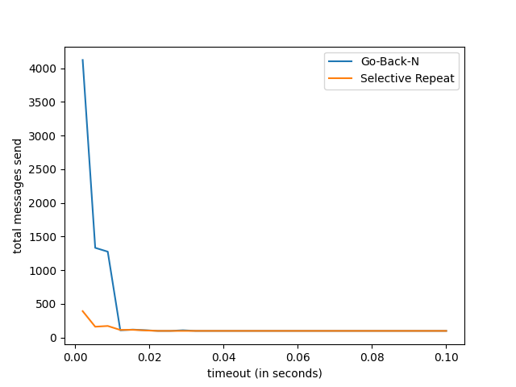
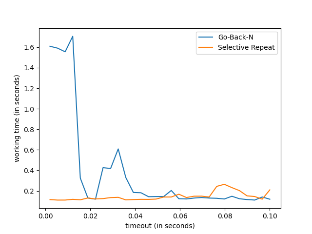
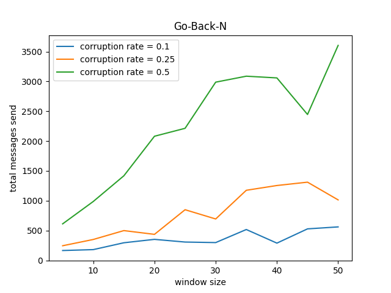
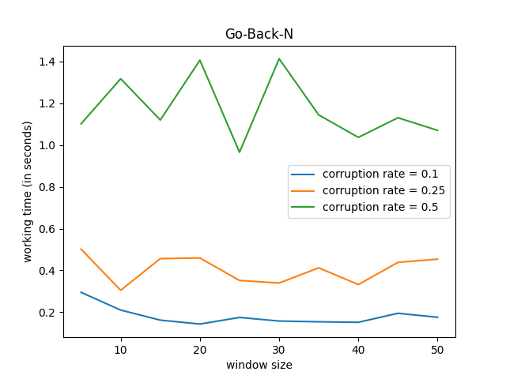
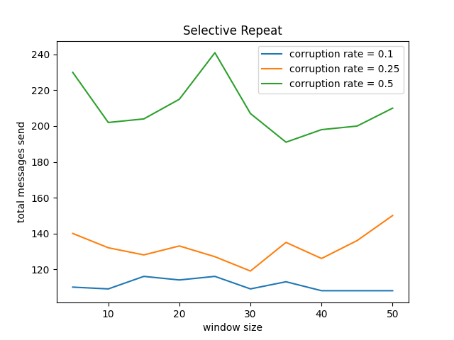
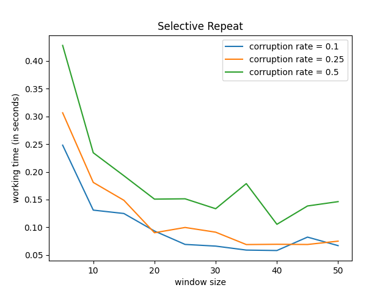
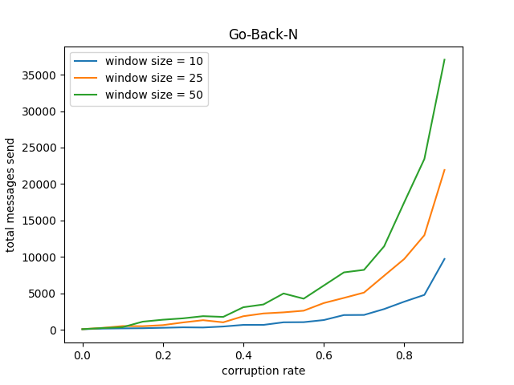
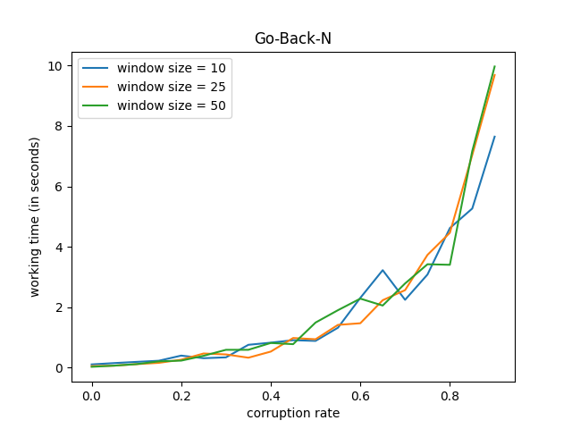
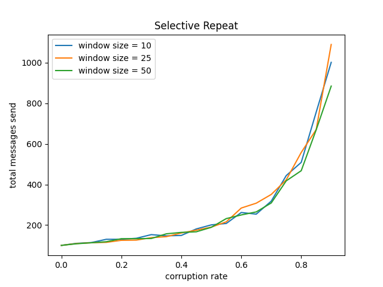
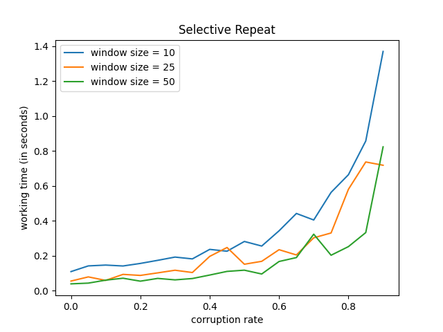

::: titlepage
::: center
Санкт-Петербургский политехнический университет\
Петра Великого\
:::

::: center
Физико-механический иститут
:::

::: center
Кафедра «Прикладная математика»
:::

::: center
**Отчёт по лабораторной работе\
по дисциплине «Компьютерные сети»\
Реализация протоколов автоматического запроса повторной передачи
Go-Back-N и Selective Repeat**
:::

::: flushleft
Выполнил студент:\
Аникин Александр Алексеевич\
группа: 5040102/20201

Проверил:\
к.ф.-м.н., доцент\
Баженов Александр Николаевич
:::

::: center
Санкт-Петербург\
2023 г.
:::
:::

# Постановка задачи

Нужно реализовать систему из двух объектов - отправителя (Sender) и
получателя (Receiver), которые будут обмениваться сообщениями по каналу
связи с помощью протоколов автоматического запроса повторной передачи со
скользящего окном: Go-Back-N и Selective Repeat.

Необходимо выяснить зависимость времени работы и количество посланных
сообщений от размера плавающего окна и вероятности потери сообщения для
каждого протокола и сравнить друг с другом.

[]{#s:theory label="s:theory"}

# Теория

Протоколы Go-Back-N и Selective Repeat являются протоколами скользящего
окна. Основное различие между этими двумя протоколами заключается в том,
что после обнаружения подозрительного или поврежденного сообщения
протокол Go-Back-N повторно передает все сообщения, не получившие
подтверждения о получении, тогда как протокол Selective Repeat повторно
передает только то сообщение, которое оказалось повреждено.

# Результаты

Введём две основные метрики, по которым будем сравнивать оба протокола:
число сообщений, которые пришлось отправить отправителю, и время работы
протокола, за которое получатель смог получить все сообщения без
повреждений. Посмотрим на зависимость этих метрик от размера окна,
времени таймаута и вероятности потери сообщения.

Во всех тестах (если не сказано обратное) число сообщений, которые
получатель должен получить от отправителя равно 100, а таймаут равен
$0.5$. Замеры времени работы проводились на машине со следующей
спецификацией cpu и памяти:

            # cpu

            Architecture:                       x86_64
            CPU op-mode(s):                     32-bit, 64-bit
            Byte Order:                         Little Endian
            Address sizes:                      39 bits physical, 48 bits virtual
            CPU(s):                             8
            On-line CPU(s) list:                0-7
            Thread(s) per core:                 2
            Core(s) per socket:                 4
            Socket(s):                          1
            NUMA node(s):                       1
            Vendor ID:                          GenuineIntel
            CPU family:                         6
            Model:                              142
            Model name:                         Intel(R) Core(TM) i5-8265U CPU @ 1.60GHz
            Stepping:                           12
            CPU MHz:                            1800.000
            CPU max MHz:                        3900.0000
            CPU min MHz:                        400.0000
            BogoMIPS:                           3600.00
            Virtualization:                     VT-x
            L1d cache:                          128 KiB
            L1i cache:                          128 KiB
            L2 cache:                           1 MiB
            L3 cache:                           6 MiB

            # memory

            *-memory                  
                size: 32GiB
            *-memory UNCLAIMED
                width: 64 bits
                clock: 33MHz (30.3ns)

Сначала посмотрим на зависимость числа сообщений и времени работы от
размера таймаута. Размер окна равен 10, сообщение не может быть
повреждено рис.
[\[p:timeoutsMessageNum\]](#p:timeoutsMessageNum){reference-type="ref"
reference="p:timeoutsMessageNum"} и рис.
[\[p:timeoutsWorkingTime\]](#p:timeoutsWorkingTime){reference-type="ref"
reference="p:timeoutsWorkingTime"}.

[]{#p:timeoutsMessageNum label="p:timeoutsMessageNum"}

<figure>

<figcaption>Число сообщений от таймаута (размер окна = 10, вероятность
повреждения сообщения = 0.0)</figcaption>
</figure>

[]{#p:timeoutsWorkingTime label="p:timeoutsWorkingTime"}

<figure>

<figcaption>Время работы от таймаута (размер окна = 10, вероятность
повреждения сообщения = 0.0)</figcaption>
</figure>

Видно, что при очень малых значениях таймаута, отправитель для некоторых
сообщений не успевает получить от получателя подтверждения до истечения
времени ожидания, из-за чего посылает повторные сообщения. Но с
увеличением времени таймаута такие случаи пропадают и число всех
отправленных сообщений равно числу успешно переданных сообщений.

Теперь рассмотрим значения числа всех отправленных сообщений и времени
работы в зависимости от размера окна. Сначала для протокола Go-Back-N.

[]{#p:rateSizeGBNMessageNum label="p:rateSizeGBNMessageNum"}

<figure>

<figcaption>Go-Back-N. Число сообщений от размера окна</figcaption>
</figure>

[]{#p:rateSizeGBNWorkingTime label="p:rateSizeGBNWorkingTime"}

<figure>

<figcaption>Go-Back-N. Время работы от размера окна</figcaption>
</figure>

Затем для протокола Selective Repeat.

[]{#p:rateSizeSRPMessageNum label="p:rateSizeSRPMessageNum"}

<figure>

<figcaption>Selective Repeat. Число сообщений от размера
окна</figcaption>
</figure>

[]{#p:rateSizeSRPWorkingTime label="p:rateSizeSRPWorkingTime"}

<figure>

<figcaption>Selective Repeat. Время работы от размера окна</figcaption>
</figure>

Как видно из рисунка
[\[p:rateSizeGBNMessageNum\]](#p:rateSizeGBNMessageNum){reference-type="ref"
reference="p:rateSizeGBNMessageNum"} общее число отправленных сообщений
в протоколе Go-Back-N прямо пропорционально размеру окна, что особенно
заметно при больших значениях вероятности потери сообщения. Но при этом
время работы Go-Back-N не зависит от размера окна (рис.
[\[p:rateSizeGBNWorkingTime\]](#p:rateSizeGBNWorkingTime){reference-type="ref"
reference="p:rateSizeGBNWorkingTime"}). С другой стороны, для протокола
Selective Repeat размер окна не влияет на общее число отпралвенных
сообещний (рис.
[\[p:rateSizeSRPMessageNum\]](#p:rateSizeSRPMessageNum){reference-type="ref"
reference="p:rateSizeSRPMessageNum"}). При этом время работы протокола
Selective Repeat тем меньше, чем больше размер окна, но с увеличением
размера прирост скорости работы становиться всё меньше (рис.
[\[p:rateSizeSRPWorkingTime\]](#p:rateSizeSRPWorkingTime){reference-type="ref"
reference="p:rateSizeSRPWorkingTime"}).

Также рассмотрим зависимость тех же метрик от вероятности потери
сообщения. Для Go-Back-N имеем.

[]{#p:sizeRateGBNMessageNum label="p:sizeRateGBNMessageNum"}

<figure>

<figcaption>Go-Back-N. Число сообщений от вероятности потери
сообщения</figcaption>
</figure>

[]{#p:sizeRateGBNWorkingTime label="p:sizeRateGBNWorkingTime"}

<figure>

<figcaption>Go-Back-N. Время работы от вероятности потери
сообщения</figcaption>
</figure>

А для Selective Repeat.

[]{#p:sizeRateSRPMessageNum label="p:sizeRateSRPMessageNum"}

<figure>

<figcaption>Selective Repeat. Число сообщений от вероятности потери
сообщения</figcaption>
</figure>

[]{#p:sizeRateSRPWorkingTime label="p:sizeRateSRPWorkingTime"}

<figure>

<figcaption>Selective Repeat. Время работы от вероятности потери
сообщения</figcaption>
</figure>

Как видно на рисунках
[\[p:sizeRateGBNMessageNum\]](#p:sizeRateGBNMessageNum){reference-type="ref"
reference="p:sizeRateGBNMessageNum"},
[\[p:sizeRateSRPMessageNum\]](#p:sizeRateSRPMessageNum){reference-type="ref"
reference="p:sizeRateSRPMessageNum"} общее число отправленных сообщений
с ростом вероятности потери сообщения у протокола Go-Back-N сильно
больше, чем у протокола Selective Repeat. Как следствие, Go-Back-N
работает значительно дольше, чем Selective Repeat (рис.
[\[p:sizeRateGBNWorkingTime\]](#p:sizeRateGBNWorkingTime){reference-type="ref"
reference="p:sizeRateGBNWorkingTime"},
[\[p:sizeRateSRPWorkingTime\]](#p:sizeRateSRPWorkingTime){reference-type="ref"
reference="p:sizeRateSRPWorkingTime"}).

# Обсуждение

Из приведённых результатов можно заметить, что в одинаковых условиях
протоколу Selective Repeat требуется отправить меньше сообщений, чем
протоколу Go-Back-N. Что ожидаемо, в силу разной обработки и повторной
передачи потерянных сообщений (раздел
[\[s:theory\]](#s:theory){reference-type="ref" reference="s:theory"}).
Как следствие, протокол Selective Repeat работает значительно быстрее
протокола Go-Back-N.
