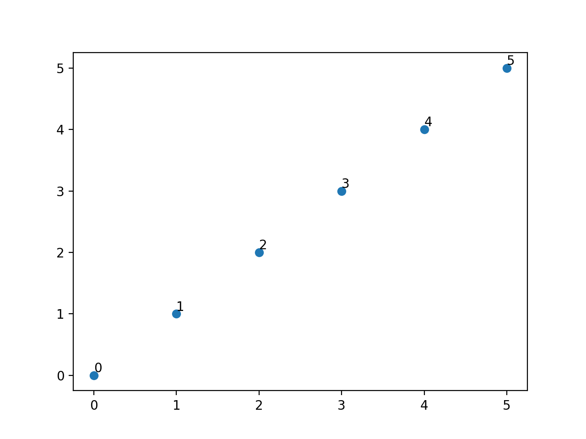
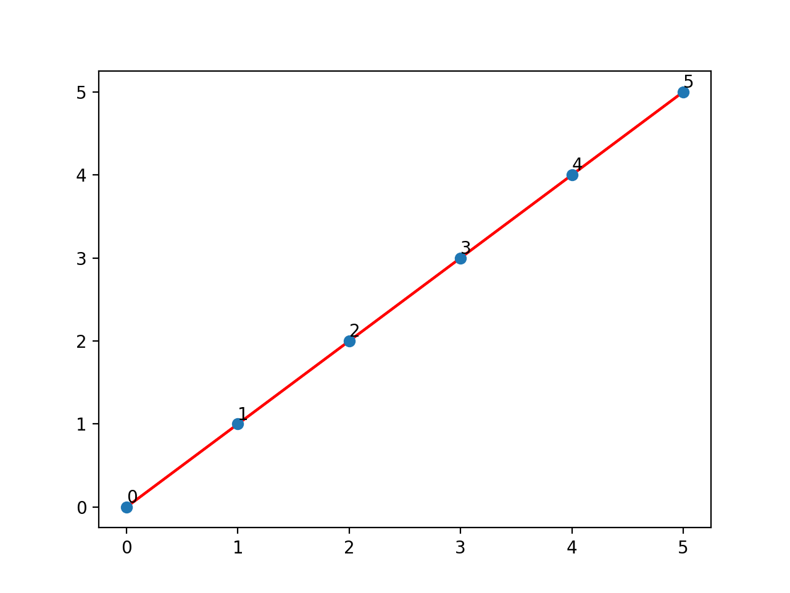
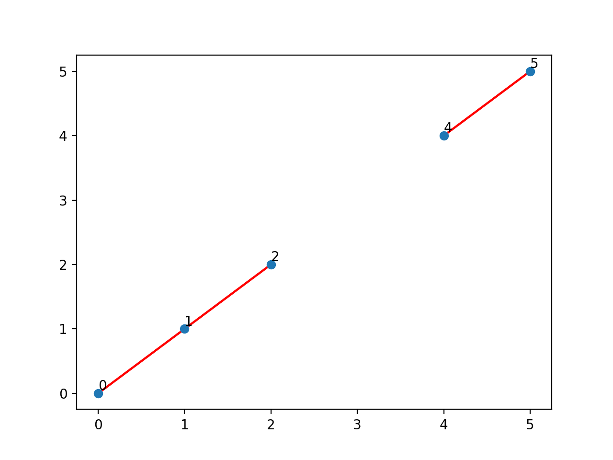
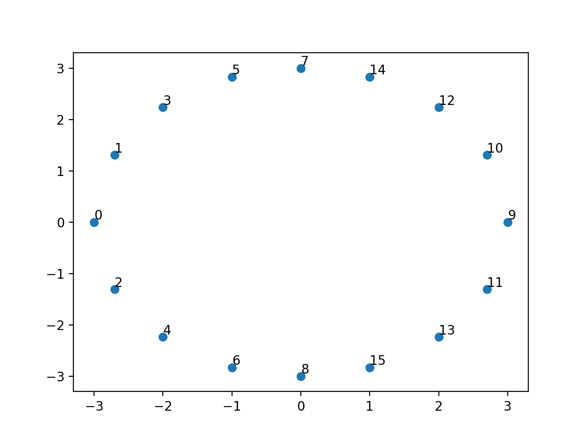
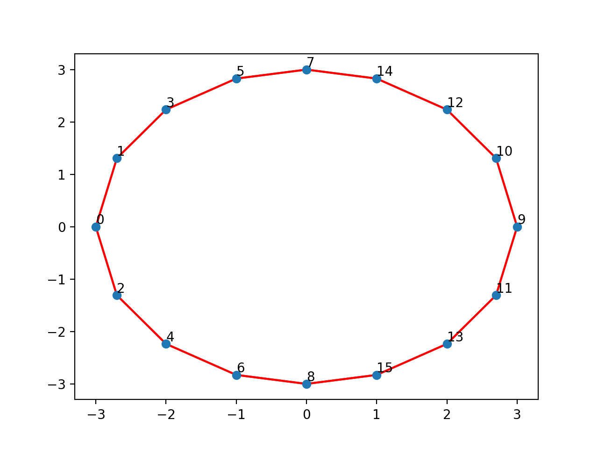
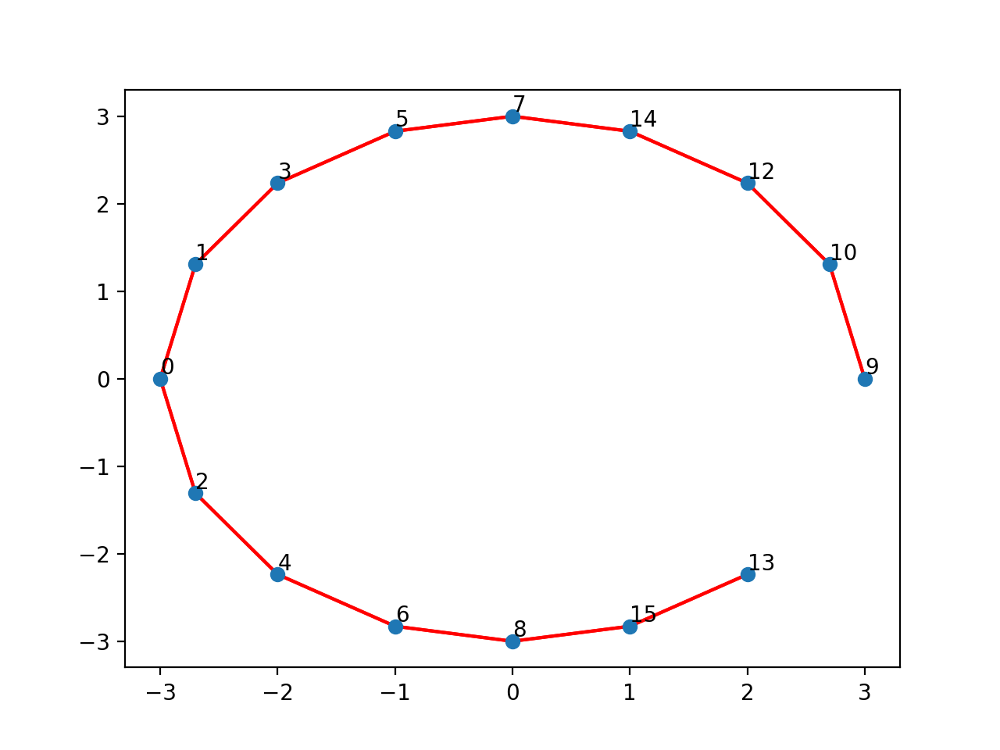
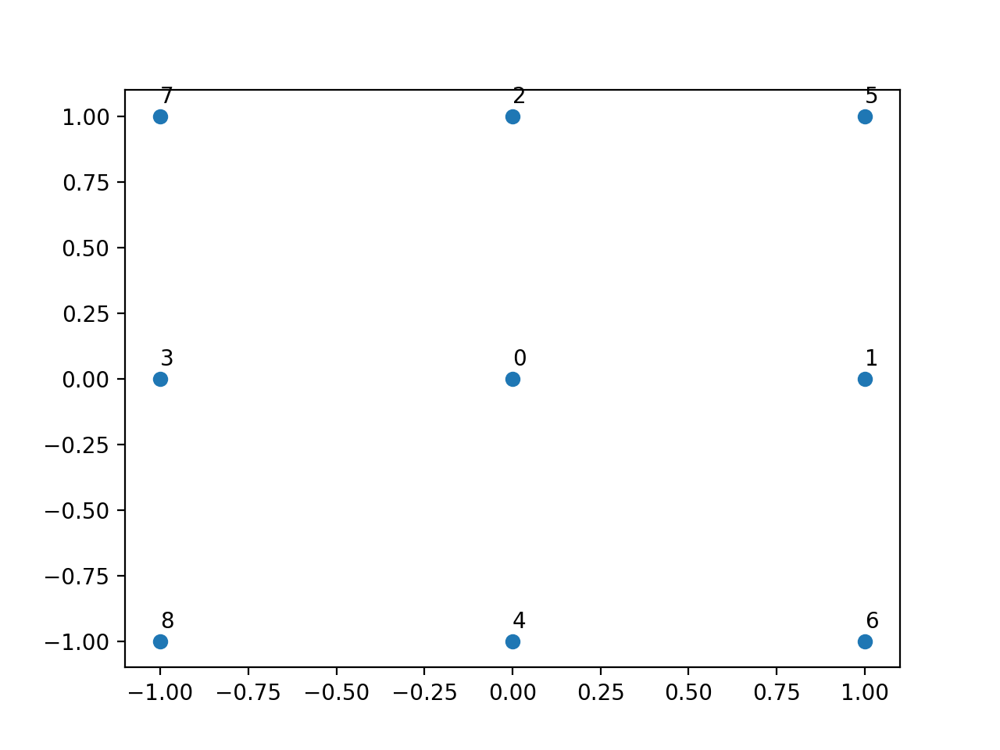
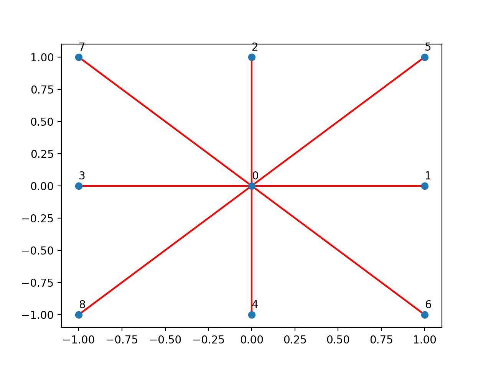
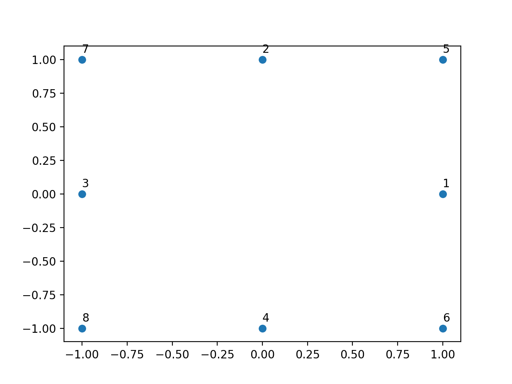

::: titlepage
::: center
Санкт-Петербургский политехнический университет\
Петра Великого\
:::

::: center
Физико-механический иститут
:::

::: center
Кафедра «Прикладная математика»
:::

::: center
**Отчёт по лабораторной работе\
по дисциплине «Компьютерные сети»\
Реализация протокола маршрутизации Open Shortest Path First**
:::

::: flushleft
Выполнил студент:\
Аникин Александр Алексеевич\
группа: 5040102/20201

Проверил:\
к.ф.-м.н., доцент\
Баженов Александр Николаевич
:::

::: center
Санкт-Петербург\
2023 г.
:::
:::

# Постановка задачи

Нужно реализовать протокол маршрутизации OSPF (Open Shortest Path
First). И проверить его работоспособность на следующих видах топологий
сети: линейная, кольцевидная и звёздная.

# Теория

OSPF (Open Shortest Path First) --- протокол динамической маршрутизации,
основанный на технологии отслеживания состояния канала и использующий
для нахождения кратчайшего пути алгоритм Дейкстры.

Описание работы протокола.

-   После включения маршрутизаторов протокол ищет непосредственно
    подключенных соседей и устанавливает с ними «дружеские» отношения.

-   Затем они обмениваются друг с другом информацией о подключенных и
    доступных им сетях. То есть они строят карту сети (топологию сети).
    Данная карта одинакова на всех маршрутизаторах.

-   На основе полученной информации запускается алгоритм SPF (Shortest
    Path First), который рассчитывает оптимальный маршрут к каждой сети.
    Данный процесс похож на построение дерева, корнем которого является
    сам маршрутизатор, а ветвями --- пути к доступным сетям.

# Результаты

Сначала посмотрим на работу протокола на сети с линейной топологией.
Узлы сети имеют следующее расположение.

[]{#p:fullLinePoints label="p:fullLinePoints"}

<figure>
<div class="center">

</div>
<figcaption>Расположение узлов сети с линейной топологией</figcaption>
</figure>

Построим граф сети, указав радиус соединения равным $r = 1.5$.

[]{#p:fullLine label="p:fullLine"}

<figure>
<div class="center">

</div>
<figcaption>Граф сети с линейной топологией</figcaption>
</figure>

Найдём кратчайшие пути между всеми парами узлов сети. Приведём некоторые
примеры (полные результаты в файле *lab2/results/line_full.txt*).

``` default
Start node 0:
path 0 -> 0: [0]
path 0 -> 1: [0, 1]
path 0 -> 2: [0, 1, 2]
path 0 -> 3: [0, 1, 2, 3]
path 0 -> 4: [0, 1, 2, 3, 4]
path 0 -> 5: [0, 1, 2, 3, 4, 5]
###################################
Start node 1:
path 1 -> 0: [1, 0]
path 1 -> 1: [1]
path 1 -> 2: [1, 2]
path 1 -> 3: [1, 2, 3]
path 1 -> 4: [1, 2, 3, 4]
path 1 -> 5: [1, 2, 3, 4, 5]
###################################
Start node 2:
path 2 -> 0: [2, 1, 0]
path 2 -> 1: [2, 1]
path 2 -> 2: [2]
path 2 -> 3: [2, 3]
path 2 -> 4: [2, 3, 4]
path 2 -> 5: [2, 3, 4, 5]
###################################
Start node 3:
path 3 -> 0: [3, 2, 1, 0]
path 3 -> 1: [3, 2, 1]
path 3 -> 2: [3, 2]
path 3 -> 3: [3]
path 3 -> 4: [3, 4]
path 3 -> 5: [3, 4, 5]
###################################
Start node 4:
path 4 -> 0: [4, 3, 2, 1, 0]
path 4 -> 1: [4, 3, 2, 1]
path 4 -> 2: [4, 3, 2]
path 4 -> 3: [4, 3]
path 4 -> 4: [4]
path 4 -> 5: [4, 5]
###################################
Start node 5:
path 5 -> 0: [5, 4, 3, 2, 1, 0]
path 5 -> 1: [5, 4, 3, 2, 1]
path 5 -> 2: [5, 4, 3, 2]
path 5 -> 3: [5, 4, 3]
path 5 -> 4: [5, 4]
path 5 -> 5: [5]
###################################
```

Теперь уберём из сети узел $3$ (перенеся его достаточно далеко) и
перестроим граф сети.

[]{#p:rmLine label="p:rmLine"}

<figure>
<div class="center">

</div>
<figcaption>Граф сети с линейной топологией без <span
class="math inline">3</span> узла</figcaption>
</figure>

Приведём кратчайшие пути для тех же пар узлов (полные результаты в файле
*lab2/results/line_remove.txt*).

``` default
Start node 0:
path 0 -> 0: [0]
path 0 -> 1: [0, 1]
path 0 -> 2: [0, 1, 2]
path 0 -> 3: []
path 0 -> 4: []
path 0 -> 5: []
###################################
Start node 1:
path 1 -> 0: [1, 0]
path 1 -> 1: [1]
path 1 -> 2: [1, 2]
path 1 -> 3: []
path 1 -> 4: []
path 1 -> 5: []
###################################
Start node 2:
path 2 -> 0: [2, 1, 0]
path 2 -> 1: [2, 1]
path 2 -> 2: [2]
path 2 -> 3: []
path 2 -> 4: []
path 2 -> 5: []
###################################
Start node 3:
path 3 -> 0: []
path 3 -> 1: []
path 3 -> 2: []
path 3 -> 3: [3]
path 3 -> 4: []
path 3 -> 5: []
###################################
Start node 4:
path 4 -> 0: []
path 4 -> 1: []
path 4 -> 2: []
path 4 -> 3: []
path 4 -> 4: [4]
path 4 -> 5: [4, 5]
###################################
Start node 5:
path 5 -> 0: []
path 5 -> 1: []
path 5 -> 2: []
path 5 -> 3: []
path 5 -> 4: [5, 4]
path 5 -> 5: [5]
###################################
```

Проведём аналогичную процедуру для сети с кольцевидной топологией.

[]{#p:fullRingPoints label="p:fullRingPoints"}

<figure>
<div class="center">

</div>
<figcaption>Расположение узлов сети с кольцевидной
топологией</figcaption>
</figure>

Граф, построенный с радиусом соединения $r = 1.7$, сети имеет вид.

[]{#p:fullRing label="p:fullRing"}

<figure>
<div class="center">

</div>
<figcaption>Граф сети с кольцевидной топологией</figcaption>
</figure>

Примеры кратчайших путей (подробнее *lab2/results/ring_full.txt*)

``` default
Start node 0:
path 0 -> 0: [0]
path 0 -> 1: [0, 1]
path 0 -> 2: [0, 2]
path 0 -> 3: [0, 1, 3]
path 0 -> 4: [0, 2, 4]
path 0 -> 5: [0, 1, 3, 5]
path 0 -> 6: [0, 2, 4, 6]
path 0 -> 7: [0, 1, 3, 5, 7]
path 0 -> 8: [0, 2, 4, 6, 8]
path 0 -> 9: [0, 1, 3, 5, 7, 14, 12, 10, 9]
path 0 -> 10: [0, 1, 3, 5, 7, 14, 12, 10]
path 0 -> 11: [0, 2, 4, 6, 8, 15, 13, 11]
path 0 -> 12: [0, 1, 3, 5, 7, 14, 12]
path 0 -> 13: [0, 2, 4, 6, 8, 15, 13]
path 0 -> 14: [0, 1, 3, 5, 7, 14]
path 0 -> 15: [0, 2, 4, 6, 8, 15]
###################################
Start node 1:
path 1 -> 0: [1, 0]
path 1 -> 1: [1]
path 1 -> 2: [1, 0, 2]
path 1 -> 3: [1, 3]
path 1 -> 4: [1, 0, 2, 4]
path 1 -> 5: [1, 3, 5]
path 1 -> 6: [1, 0, 2, 4, 6]
path 1 -> 7: [1, 3, 5, 7]
path 1 -> 8: [1, 0, 2, 4, 6, 8]
path 1 -> 9: [1, 3, 5, 7, 14, 12, 10, 9]
path 1 -> 10: [1, 3, 5, 7, 14, 12, 10]
path 1 -> 11: [1, 3, 5, 7, 14, 12, 10, 9, 11]
path 1 -> 12: [1, 3, 5, 7, 14, 12]
path 1 -> 13: [1, 0, 2, 4, 6, 8, 15, 13]
path 1 -> 14: [1, 3, 5, 7, 14]
path 1 -> 15: [1, 0, 2, 4, 6, 8, 15]
###################################
Start node 2:
path 2 -> 0: [2, 0]
path 2 -> 1: [2, 0, 1]
path 2 -> 2: [2]
path 2 -> 3: [2, 0, 1, 3]
path 2 -> 4: [2, 4]
path 2 -> 5: [2, 0, 1, 3, 5]
path 2 -> 6: [2, 4, 6]
path 2 -> 7: [2, 0, 1, 3, 5, 7]
path 2 -> 8: [2, 4, 6, 8]
path 2 -> 9: [2, 4, 6, 8, 15, 13, 11, 9]
path 2 -> 10: [2, 4, 6, 8, 15, 13, 11, 9, 10]
path 2 -> 11: [2, 4, 6, 8, 15, 13, 11]
path 2 -> 12: [2, 0, 1, 3, 5, 7, 14, 12]
path 2 -> 13: [2, 4, 6, 8, 15, 13]
path 2 -> 14: [2, 0, 1, 3, 5, 7, 14]
path 2 -> 15: [2, 4, 6, 8, 15]
###################################
Start node 3:
path 3 -> 0: [3, 1, 0]
path 3 -> 1: [3, 1]
path 3 -> 2: [3, 1, 0, 2]
path 3 -> 3: [3]
path 3 -> 4: [3, 1, 0, 2, 4]
path 3 -> 5: [3, 5]
path 3 -> 6: [3, 1, 0, 2, 4, 6]
path 3 -> 7: [3, 5, 7]
path 3 -> 8: [3, 1, 0, 2, 4, 6, 8]
path 3 -> 9: [3, 5, 7, 14, 12, 10, 9]
path 3 -> 10: [3, 5, 7, 14, 12, 10]
path 3 -> 11: [3, 5, 7, 14, 12, 10, 9, 11]
path 3 -> 12: [3, 5, 7, 14, 12]
path 3 -> 13: [3, 5, 7, 14, 12, 10, 9, 11, 13]
path 3 -> 14: [3, 5, 7, 14]
path 3 -> 15: [3, 1, 0, 2, 4, 6, 8, 15]
###################################
Start node 4:
path 4 -> 0: [4, 2, 0]
path 4 -> 1: [4, 2, 0, 1]
path 4 -> 2: [4, 2]
path 4 -> 3: [4, 2, 0, 1, 3]
path 4 -> 4: [4]
path 4 -> 5: [4, 2, 0, 1, 3, 5]
path 4 -> 6: [4, 6]
path 4 -> 7: [4, 2, 0, 1, 3, 5, 7]
path 4 -> 8: [4, 6, 8]
path 4 -> 9: [4, 6, 8, 15, 13, 11, 9]
path 4 -> 10: [4, 6, 8, 15, 13, 11, 9, 10]
path 4 -> 11: [4, 6, 8, 15, 13, 11]
path 4 -> 12: [4, 6, 8, 15, 13, 11, 9, 10, 12]
path 4 -> 13: [4, 6, 8, 15, 13]
path 4 -> 14: [4, 2, 0, 1, 3, 5, 7, 14]
path 4 -> 15: [4, 6, 8, 15]
###################################
Start node 5:
path 5 -> 0: [5, 3, 1, 0]
path 5 -> 1: [5, 3, 1]
path 5 -> 2: [5, 3, 1, 0, 2]
path 5 -> 3: [5, 3]
path 5 -> 4: [5, 3, 1, 0, 2, 4]
path 5 -> 5: [5]
path 5 -> 6: [5, 3, 1, 0, 2, 4, 6]
path 5 -> 7: [5, 7]
path 5 -> 8: [5, 3, 1, 0, 2, 4, 6, 8]
path 5 -> 9: [5, 7, 14, 12, 10, 9]
path 5 -> 10: [5, 7, 14, 12, 10]
path 5 -> 11: [5, 7, 14, 12, 10, 9, 11]
path 5 -> 12: [5, 7, 14, 12]
path 5 -> 13: [5, 7, 14, 12, 10, 9, 11, 13]
path 5 -> 14: [5, 7, 14]
path 5 -> 15: [5, 7, 14, 12, 10, 9, 11, 13, 15]
###################################
Start node 6:
path 6 -> 0: [6, 4, 2, 0]
path 6 -> 1: [6, 4, 2, 0, 1]
path 6 -> 2: [6, 4, 2]
path 6 -> 3: [6, 4, 2, 0, 1, 3]
path 6 -> 4: [6, 4]
path 6 -> 5: [6, 4, 2, 0, 1, 3, 5]
path 6 -> 6: [6]
path 6 -> 7: [6, 4, 2, 0, 1, 3, 5, 7]
path 6 -> 8: [6, 8]
path 6 -> 9: [6, 8, 15, 13, 11, 9]
path 6 -> 10: [6, 8, 15, 13, 11, 9, 10]
path 6 -> 11: [6, 8, 15, 13, 11]
path 6 -> 12: [6, 8, 15, 13, 11, 9, 10, 12]
path 6 -> 13: [6, 8, 15, 13]
path 6 -> 14: [6, 8, 15, 13, 11, 9, 10, 12, 14]
path 6 -> 15: [6, 8, 15]
###################################
Start node 7:
path 7 -> 0: [7, 5, 3, 1, 0]
path 7 -> 1: [7, 5, 3, 1]
path 7 -> 2: [7, 5, 3, 1, 0, 2]
path 7 -> 3: [7, 5, 3]
path 7 -> 4: [7, 5, 3, 1, 0, 2, 4]
path 7 -> 5: [7, 5]
path 7 -> 6: [7, 5, 3, 1, 0, 2, 4, 6]
path 7 -> 7: [7]
path 7 -> 8: [7, 5, 3, 1, 0, 2, 4, 6, 8]
path 7 -> 9: [7, 14, 12, 10, 9]
path 7 -> 10: [7, 14, 12, 10]
path 7 -> 11: [7, 14, 12, 10, 9, 11]
path 7 -> 12: [7, 14, 12]
path 7 -> 13: [7, 14, 12, 10, 9, 11, 13]
path 7 -> 14: [7, 14]
path 7 -> 15: [7, 14, 12, 10, 9, 11, 13, 15]
###################################
Start node 8:
path 8 -> 0: [8, 6, 4, 2, 0]
path 8 -> 1: [8, 6, 4, 2, 0, 1]
path 8 -> 2: [8, 6, 4, 2]
path 8 -> 3: [8, 6, 4, 2, 0, 1, 3]
path 8 -> 4: [8, 6, 4]
path 8 -> 5: [8, 6, 4, 2, 0, 1, 3, 5]
path 8 -> 6: [8, 6]
path 8 -> 7: [8, 6, 4, 2, 0, 1, 3, 5, 7]
path 8 -> 8: [8]
path 8 -> 9: [8, 15, 13, 11, 9]
path 8 -> 10: [8, 15, 13, 11, 9, 10]
path 8 -> 11: [8, 15, 13, 11]
path 8 -> 12: [8, 15, 13, 11, 9, 10, 12]
path 8 -> 13: [8, 15, 13]
path 8 -> 14: [8, 15, 13, 11, 9, 10, 12, 14]
path 8 -> 15: [8, 15]
###################################
Start node 9:
path 9 -> 0: [9, 10, 12, 14, 7, 5, 3, 1, 0]
path 9 -> 1: [9, 10, 12, 14, 7, 5, 3, 1]
path 9 -> 2: [9, 11, 13, 15, 8, 6, 4, 2]
path 9 -> 3: [9, 10, 12, 14, 7, 5, 3]
path 9 -> 4: [9, 11, 13, 15, 8, 6, 4]
path 9 -> 5: [9, 10, 12, 14, 7, 5]
path 9 -> 6: [9, 11, 13, 15, 8, 6]
path 9 -> 7: [9, 10, 12, 14, 7]
path 9 -> 8: [9, 11, 13, 15, 8]
path 9 -> 9: [9]
path 9 -> 10: [9, 10]
path 9 -> 11: [9, 11]
path 9 -> 12: [9, 10, 12]
path 9 -> 13: [9, 11, 13]
path 9 -> 14: [9, 10, 12, 14]
path 9 -> 15: [9, 11, 13, 15]
###################################
Start node 10:
path 10 -> 0: [10, 12, 14, 7, 5, 3, 1, 0]
path 10 -> 1: [10, 12, 14, 7, 5, 3, 1]
path 10 -> 2: [10, 12, 14, 7, 5, 3, 1, 0, 2]
path 10 -> 3: [10, 12, 14, 7, 5, 3]
path 10 -> 4: [10, 9, 11, 13, 15, 8, 6, 4]
path 10 -> 5: [10, 12, 14, 7, 5]
path 10 -> 6: [10, 9, 11, 13, 15, 8, 6]
path 10 -> 7: [10, 12, 14, 7]
path 10 -> 8: [10, 9, 11, 13, 15, 8]
path 10 -> 9: [10, 9]
path 10 -> 10: [10]
path 10 -> 11: [10, 9, 11]
path 10 -> 12: [10, 12]
path 10 -> 13: [10, 9, 11, 13]
path 10 -> 14: [10, 12, 14]
path 10 -> 15: [10, 9, 11, 13, 15]
###################################
Start node 11:
path 11 -> 0: [11, 13, 15, 8, 6, 4, 2, 0]
path 11 -> 1: [11, 13, 15, 8, 6, 4, 2, 0, 1]
path 11 -> 2: [11, 13, 15, 8, 6, 4, 2]
path 11 -> 3: [11, 9, 10, 12, 14, 7, 5, 3]
path 11 -> 4: [11, 13, 15, 8, 6, 4]
path 11 -> 5: [11, 9, 10, 12, 14, 7, 5]
path 11 -> 6: [11, 13, 15, 8, 6]
path 11 -> 7: [11, 9, 10, 12, 14, 7]
path 11 -> 8: [11, 13, 15, 8]
path 11 -> 9: [11, 9]
path 11 -> 10: [11, 9, 10]
path 11 -> 11: [11]
path 11 -> 12: [11, 9, 10, 12]
path 11 -> 13: [11, 13]
path 11 -> 14: [11, 9, 10, 12, 14]
path 11 -> 15: [11, 13, 15]
###################################
Start node 12:
path 12 -> 0: [12, 14, 7, 5, 3, 1, 0]
path 12 -> 1: [12, 14, 7, 5, 3, 1]
path 12 -> 2: [12, 14, 7, 5, 3, 1, 0, 2]
path 12 -> 3: [12, 14, 7, 5, 3]
path 12 -> 4: [12, 14, 7, 5, 3, 1, 0, 2, 4]
path 12 -> 5: [12, 14, 7, 5]
path 12 -> 6: [12, 10, 9, 11, 13, 15, 8, 6]
path 12 -> 7: [12, 14, 7]
path 12 -> 8: [12, 10, 9, 11, 13, 15, 8]
path 12 -> 9: [12, 10, 9]
path 12 -> 10: [12, 10]
path 12 -> 11: [12, 10, 9, 11]
path 12 -> 12: [12]
path 12 -> 13: [12, 10, 9, 11, 13]
path 12 -> 14: [12, 14]
path 12 -> 15: [12, 10, 9, 11, 13, 15]
###################################
Start node 13:
path 13 -> 0: [13, 15, 8, 6, 4, 2, 0]
path 13 -> 1: [13, 15, 8, 6, 4, 2, 0, 1]
path 13 -> 2: [13, 15, 8, 6, 4, 2]
path 13 -> 3: [13, 15, 8, 6, 4, 2, 0, 1, 3]
path 13 -> 4: [13, 15, 8, 6, 4]
path 13 -> 5: [13, 11, 9, 10, 12, 14, 7, 5]
path 13 -> 6: [13, 15, 8, 6]
path 13 -> 7: [13, 11, 9, 10, 12, 14, 7]
path 13 -> 8: [13, 15, 8]
path 13 -> 9: [13, 11, 9]
path 13 -> 10: [13, 11, 9, 10]
path 13 -> 11: [13, 11]
path 13 -> 12: [13, 11, 9, 10, 12]
path 13 -> 13: [13]
path 13 -> 14: [13, 11, 9, 10, 12, 14]
path 13 -> 15: [13, 15]
###################################
Start node 14:
path 14 -> 0: [14, 7, 5, 3, 1, 0]
path 14 -> 1: [14, 7, 5, 3, 1]
path 14 -> 2: [14, 7, 5, 3, 1, 0, 2]
path 14 -> 3: [14, 7, 5, 3]
path 14 -> 4: [14, 7, 5, 3, 1, 0, 2, 4]
path 14 -> 5: [14, 7, 5]
path 14 -> 6: [14, 7, 5, 3, 1, 0, 2, 4, 6]
path 14 -> 7: [14, 7]
path 14 -> 8: [14, 12, 10, 9, 11, 13, 15, 8]
path 14 -> 9: [14, 12, 10, 9]
path 14 -> 10: [14, 12, 10]
path 14 -> 11: [14, 12, 10, 9, 11]
path 14 -> 12: [14, 12]
path 14 -> 13: [14, 12, 10, 9, 11, 13]
path 14 -> 14: [14]
path 14 -> 15: [14, 12, 10, 9, 11, 13, 15]
###################################
Start node 15:
path 15 -> 0: [15, 8, 6, 4, 2, 0]
path 15 -> 1: [15, 8, 6, 4, 2, 0, 1]
path 15 -> 2: [15, 8, 6, 4, 2]
path 15 -> 3: [15, 8, 6, 4, 2, 0, 1, 3]
path 15 -> 4: [15, 8, 6, 4]
path 15 -> 5: [15, 8, 6, 4, 2, 0, 1, 3, 5]
path 15 -> 6: [15, 8, 6]
path 15 -> 7: [15, 13, 11, 9, 10, 12, 14, 7]
path 15 -> 8: [15, 8]
path 15 -> 9: [15, 13, 11, 9]
path 15 -> 10: [15, 13, 11, 9, 10]
path 15 -> 11: [15, 13, 11]
path 15 -> 12: [15, 13, 11, 9, 10, 12]
path 15 -> 13: [15, 13]
path 15 -> 14: [15, 13, 11, 9, 10, 12, 14]
path 15 -> 15: [15]
###################################
```

После удаления узла $11$ граф сети имеет вид.

[]{#p:rmRing label="p:rmRing"}

<figure>
<div class="center">

</div>
<figcaption>Граф сети с кольцевидной топологией без <span
class="math inline">11</span> узла</figcaption>
</figure>

Примеры путей для тех же пар узлов (подробнее
*lab2/results/ring_remove.txt*)

``` default
Start node 0:
path 0 -> 0: [0]
path 0 -> 1: [0, 1]
path 0 -> 2: [0, 2]
path 0 -> 3: [0, 1, 3]
path 0 -> 4: [0, 2, 4]
path 0 -> 5: [0, 1, 3, 5]
path 0 -> 6: [0, 2, 4, 6]
path 0 -> 7: [0, 1, 3, 5, 7]
path 0 -> 8: [0, 2, 4, 6, 8]
path 0 -> 9: [0, 1, 3, 5, 7, 14, 12, 10, 9]
path 0 -> 10: [0, 1, 3, 5, 7, 14, 12, 10]
path 0 -> 11: []
path 0 -> 12: [0, 1, 3, 5, 7, 14, 12]
path 0 -> 13: [0, 2, 4, 6, 8, 15, 13]
path 0 -> 14: [0, 1, 3, 5, 7, 14]
path 0 -> 15: [0, 2, 4, 6, 8, 15]
###################################
Start node 1:
path 1 -> 0: [1, 0]
path 1 -> 1: [1]
path 1 -> 2: [1, 0, 2]
path 1 -> 3: [1, 3]
path 1 -> 4: [1, 0, 2, 4]
path 1 -> 5: [1, 3, 5]
path 1 -> 6: [1, 0, 2, 4, 6]
path 1 -> 7: [1, 3, 5, 7]
path 1 -> 8: [1, 0, 2, 4, 6, 8]
path 1 -> 9: [1, 3, 5, 7, 14, 12, 10, 9]
path 1 -> 10: [1, 3, 5, 7, 14, 12, 10]
path 1 -> 11: []
path 1 -> 12: [1, 3, 5, 7, 14, 12]
path 1 -> 13: [1, 0, 2, 4, 6, 8, 15, 13]
path 1 -> 14: [1, 3, 5, 7, 14]
path 1 -> 15: [1, 0, 2, 4, 6, 8, 15]
###################################
Start node 2:
path 2 -> 0: [2, 0]
path 2 -> 1: [2, 0, 1]
path 2 -> 2: [2]
path 2 -> 3: [2, 0, 1, 3]
path 2 -> 4: [2, 4]
path 2 -> 5: [2, 0, 1, 3, 5]
path 2 -> 6: [2, 4, 6]
path 2 -> 7: [2, 0, 1, 3, 5, 7]
path 2 -> 8: [2, 4, 6, 8]
path 2 -> 9: [2, 0, 1, 3, 5, 7, 14, 12, 10, 9]
path 2 -> 10: [2, 0, 1, 3, 5, 7, 14, 12, 10]
path 2 -> 11: []
path 2 -> 12: [2, 0, 1, 3, 5, 7, 14, 12]
path 2 -> 13: [2, 4, 6, 8, 15, 13]
path 2 -> 14: [2, 0, 1, 3, 5, 7, 14]
path 2 -> 15: [2, 4, 6, 8, 15]
###################################
Start node 3:
path 3 -> 0: [3, 1, 0]
path 3 -> 1: [3, 1]
path 3 -> 2: [3, 1, 0, 2]
path 3 -> 3: [3]
path 3 -> 4: [3, 1, 0, 2, 4]
path 3 -> 5: [3, 5]
path 3 -> 6: [3, 1, 0, 2, 4, 6]
path 3 -> 7: [3, 5, 7]
path 3 -> 8: [3, 1, 0, 2, 4, 6, 8]
path 3 -> 9: [3, 5, 7, 14, 12, 10, 9]
path 3 -> 10: [3, 5, 7, 14, 12, 10]
path 3 -> 11: []
path 3 -> 12: [3, 5, 7, 14, 12]
path 3 -> 13: [3, 1, 0, 2, 4, 6, 8, 15, 13]
path 3 -> 14: [3, 5, 7, 14]
path 3 -> 15: [3, 1, 0, 2, 4, 6, 8, 15]
###################################
Start node 4:
path 4 -> 0: [4, 2, 0]
path 4 -> 1: [4, 2, 0, 1]
path 4 -> 2: [4, 2]
path 4 -> 3: [4, 2, 0, 1, 3]
path 4 -> 4: [4]
path 4 -> 5: [4, 2, 0, 1, 3, 5]
path 4 -> 6: [4, 6]
path 4 -> 7: [4, 2, 0, 1, 3, 5, 7]
path 4 -> 8: [4, 6, 8]
path 4 -> 9: [4, 2, 0, 1, 3, 5, 7, 14, 12, 10, 9]
path 4 -> 10: [4, 2, 0, 1, 3, 5, 7, 14, 12, 10]
path 4 -> 11: []
path 4 -> 12: [4, 2, 0, 1, 3, 5, 7, 14, 12]
path 4 -> 13: [4, 6, 8, 15, 13]
path 4 -> 14: [4, 2, 0, 1, 3, 5, 7, 14]
path 4 -> 15: [4, 6, 8, 15]
###################################
Start node 5:
path 5 -> 0: [5, 3, 1, 0]
path 5 -> 1: [5, 3, 1]
path 5 -> 2: [5, 3, 1, 0, 2]
path 5 -> 3: [5, 3]
path 5 -> 4: [5, 3, 1, 0, 2, 4]
path 5 -> 5: [5]
path 5 -> 6: [5, 3, 1, 0, 2, 4, 6]
path 5 -> 7: [5, 7]
path 5 -> 8: [5, 3, 1, 0, 2, 4, 6, 8]
path 5 -> 9: [5, 7, 14, 12, 10, 9]
path 5 -> 10: [5, 7, 14, 12, 10]
path 5 -> 11: []
path 5 -> 12: [5, 7, 14, 12]
path 5 -> 13: [5, 3, 1, 0, 2, 4, 6, 8, 15, 13]
path 5 -> 14: [5, 7, 14]
path 5 -> 15: [5, 3, 1, 0, 2, 4, 6, 8, 15]
###################################
Start node 6:
path 6 -> 0: [6, 4, 2, 0]
path 6 -> 1: [6, 4, 2, 0, 1]
path 6 -> 2: [6, 4, 2]
path 6 -> 3: [6, 4, 2, 0, 1, 3]
path 6 -> 4: [6, 4]
path 6 -> 5: [6, 4, 2, 0, 1, 3, 5]
path 6 -> 6: [6]
path 6 -> 7: [6, 4, 2, 0, 1, 3, 5, 7]
path 6 -> 8: [6, 8]
path 6 -> 9: [6, 4, 2, 0, 1, 3, 5, 7, 14, 12, 10, 9]
path 6 -> 10: [6, 4, 2, 0, 1, 3, 5, 7, 14, 12, 10]
path 6 -> 11: []
path 6 -> 12: [6, 4, 2, 0, 1, 3, 5, 7, 14, 12]
path 6 -> 13: [6, 8, 15, 13]
path 6 -> 14: [6, 4, 2, 0, 1, 3, 5, 7, 14]
path 6 -> 15: [6, 8, 15]
###################################
Start node 7:
path 7 -> 0: [7, 5, 3, 1, 0]
path 7 -> 1: [7, 5, 3, 1]
path 7 -> 2: [7, 5, 3, 1, 0, 2]
path 7 -> 3: [7, 5, 3]
path 7 -> 4: [7, 5, 3, 1, 0, 2, 4]
path 7 -> 5: [7, 5]
path 7 -> 6: [7, 5, 3, 1, 0, 2, 4, 6]
path 7 -> 7: [7]
path 7 -> 8: [7, 5, 3, 1, 0, 2, 4, 6, 8]
path 7 -> 9: [7, 14, 12, 10, 9]
path 7 -> 10: [7, 14, 12, 10]
path 7 -> 11: []
path 7 -> 12: [7, 14, 12]
path 7 -> 13: [7, 5, 3, 1, 0, 2, 4, 6, 8, 15, 13]
path 7 -> 14: [7, 14]
path 7 -> 15: [7, 5, 3, 1, 0, 2, 4, 6, 8, 15]
###################################
Start node 8:
path 8 -> 0: [8, 6, 4, 2, 0]
path 8 -> 1: [8, 6, 4, 2, 0, 1]
path 8 -> 2: [8, 6, 4, 2]
path 8 -> 3: [8, 6, 4, 2, 0, 1, 3]
path 8 -> 4: [8, 6, 4]
path 8 -> 5: [8, 6, 4, 2, 0, 1, 3, 5]
path 8 -> 6: [8, 6]
path 8 -> 7: [8, 6, 4, 2, 0, 1, 3, 5, 7]
path 8 -> 8: [8]
path 8 -> 9: [8, 6, 4, 2, 0, 1, 3, 5, 7, 14, 12, 10, 9]
path 8 -> 10: [8, 6, 4, 2, 0, 1, 3, 5, 7, 14, 12, 10]
path 8 -> 11: []
path 8 -> 12: [8, 6, 4, 2, 0, 1, 3, 5, 7, 14, 12]
path 8 -> 13: [8, 15, 13]
path 8 -> 14: [8, 6, 4, 2, 0, 1, 3, 5, 7, 14]
path 8 -> 15: [8, 15]
###################################
Start node 9:
path 9 -> 0: [9, 10, 12, 14, 7, 5, 3, 1, 0]
path 9 -> 1: [9, 10, 12, 14, 7, 5, 3, 1]
path 9 -> 2: [9, 10, 12, 14, 7, 5, 3, 1, 0, 2]
path 9 -> 3: [9, 10, 12, 14, 7, 5, 3]
path 9 -> 4: [9, 10, 12, 14, 7, 5, 3, 1, 0, 2, 4]
path 9 -> 5: [9, 10, 12, 14, 7, 5]
path 9 -> 6: [9, 10, 12, 14, 7, 5, 3, 1, 0, 2, 4, 6]
path 9 -> 7: [9, 10, 12, 14, 7]
path 9 -> 8: [9, 10, 12, 14, 7, 5, 3, 1, 0, 2, 4, 6, 8]
path 9 -> 9: [9]
path 9 -> 10: [9, 10]
path 9 -> 11: []
path 9 -> 12: [9, 10, 12]
path 9 -> 13: [9, 10, 12, 14, 7, 5, 3, 1, 0, 2, 4, 6, 8, 15, 13]
path 9 -> 14: [9, 10, 12, 14]
path 9 -> 15: [9, 10, 12, 14, 7, 5, 3, 1, 0, 2, 4, 6, 8, 15]
###################################
Start node 10:
path 10 -> 0: [10, 12, 14, 7, 5, 3, 1, 0]
path 10 -> 1: [10, 12, 14, 7, 5, 3, 1]
path 10 -> 2: [10, 12, 14, 7, 5, 3, 1, 0, 2]
path 10 -> 3: [10, 12, 14, 7, 5, 3]
path 10 -> 4: [10, 12, 14, 7, 5, 3, 1, 0, 2, 4]
path 10 -> 5: [10, 12, 14, 7, 5]
path 10 -> 6: [10, 12, 14, 7, 5, 3, 1, 0, 2, 4, 6]
path 10 -> 7: [10, 12, 14, 7]
path 10 -> 8: [10, 12, 14, 7, 5, 3, 1, 0, 2, 4, 6, 8]
path 10 -> 9: [10, 9]
path 10 -> 10: [10]
path 10 -> 11: []
path 10 -> 12: [10, 12]
path 10 -> 13: [10, 12, 14, 7, 5, 3, 1, 0, 2, 4, 6, 8, 15, 13]
path 10 -> 14: [10, 12, 14]
path 10 -> 15: [10, 12, 14, 7, 5, 3, 1, 0, 2, 4, 6, 8, 15]
###################################
Start node 11:
path 11 -> 0: []
path 11 -> 1: []
path 11 -> 2: []
path 11 -> 3: []
path 11 -> 4: []
path 11 -> 5: []
path 11 -> 6: []
path 11 -> 7: []
path 11 -> 8: []
path 11 -> 9: []
path 11 -> 10: []
path 11 -> 11: [11]
path 11 -> 12: []
path 11 -> 13: []
path 11 -> 14: []
path 11 -> 15: []
###################################
Start node 12:
path 12 -> 0: [12, 14, 7, 5, 3, 1, 0]
path 12 -> 1: [12, 14, 7, 5, 3, 1]
path 12 -> 2: [12, 14, 7, 5, 3, 1, 0, 2]
path 12 -> 3: [12, 14, 7, 5, 3]
path 12 -> 4: [12, 14, 7, 5, 3, 1, 0, 2, 4]
path 12 -> 5: [12, 14, 7, 5]
path 12 -> 6: [12, 14, 7, 5, 3, 1, 0, 2, 4, 6]
path 12 -> 7: [12, 14, 7]
path 12 -> 8: [12, 14, 7, 5, 3, 1, 0, 2, 4, 6, 8]
path 12 -> 9: [12, 10, 9]
path 12 -> 10: [12, 10]
path 12 -> 11: []
path 12 -> 12: [12]
path 12 -> 13: [12, 14, 7, 5, 3, 1, 0, 2, 4, 6, 8, 15, 13]
path 12 -> 14: [12, 14]
path 12 -> 15: [12, 14, 7, 5, 3, 1, 0, 2, 4, 6, 8, 15]
###################################
Start node 13:
path 13 -> 0: [13, 15, 8, 6, 4, 2, 0]
path 13 -> 1: [13, 15, 8, 6, 4, 2, 0, 1]
path 13 -> 2: [13, 15, 8, 6, 4, 2]
path 13 -> 3: [13, 15, 8, 6, 4, 2, 0, 1, 3]
path 13 -> 4: [13, 15, 8, 6, 4]
path 13 -> 5: [13, 15, 8, 6, 4, 2, 0, 1, 3, 5]
path 13 -> 6: [13, 15, 8, 6]
path 13 -> 7: [13, 15, 8, 6, 4, 2, 0, 1, 3, 5, 7]
path 13 -> 8: [13, 15, 8]
path 13 -> 9: [13, 15, 8, 6, 4, 2, 0, 1, 3, 5, 7, 14, 12, 10, 9]
path 13 -> 10: [13, 15, 8, 6, 4, 2, 0, 1, 3, 5, 7, 14, 12, 10]
path 13 -> 11: []
path 13 -> 12: [13, 15, 8, 6, 4, 2, 0, 1, 3, 5, 7, 14, 12]
path 13 -> 13: [13]
path 13 -> 14: [13, 15, 8, 6, 4, 2, 0, 1, 3, 5, 7, 14]
path 13 -> 15: [13, 15]
###################################
Start node 14:
path 14 -> 0: [14, 7, 5, 3, 1, 0]
path 14 -> 1: [14, 7, 5, 3, 1]
path 14 -> 2: [14, 7, 5, 3, 1, 0, 2]
path 14 -> 3: [14, 7, 5, 3]
path 14 -> 4: [14, 7, 5, 3, 1, 0, 2, 4]
path 14 -> 5: [14, 7, 5]
path 14 -> 6: [14, 7, 5, 3, 1, 0, 2, 4, 6]
path 14 -> 7: [14, 7]
path 14 -> 8: [14, 7, 5, 3, 1, 0, 2, 4, 6, 8]
path 14 -> 9: [14, 12, 10, 9]
path 14 -> 10: [14, 12, 10]
path 14 -> 11: []
path 14 -> 12: [14, 12]
path 14 -> 13: [14, 7, 5, 3, 1, 0, 2, 4, 6, 8, 15, 13]
path 14 -> 14: [14]
path 14 -> 15: [14, 7, 5, 3, 1, 0, 2, 4, 6, 8, 15]
###################################
Start node 15:
path 15 -> 0: [15, 8, 6, 4, 2, 0]
path 15 -> 1: [15, 8, 6, 4, 2, 0, 1]
path 15 -> 2: [15, 8, 6, 4, 2]
path 15 -> 3: [15, 8, 6, 4, 2, 0, 1, 3]
path 15 -> 4: [15, 8, 6, 4]
path 15 -> 5: [15, 8, 6, 4, 2, 0, 1, 3, 5]
path 15 -> 6: [15, 8, 6]
path 15 -> 7: [15, 8, 6, 4, 2, 0, 1, 3, 5, 7]
path 15 -> 8: [15, 8]
path 15 -> 9: [15, 8, 6, 4, 2, 0, 1, 3, 5, 7, 14, 12, 10, 9]
path 15 -> 10: [15, 8, 6, 4, 2, 0, 1, 3, 5, 7, 14, 12, 10]
path 15 -> 11: []
path 15 -> 12: [15, 8, 6, 4, 2, 0, 1, 3, 5, 7, 14, 12]
path 15 -> 13: [15, 13]
path 15 -> 14: [15, 8, 6, 4, 2, 0, 1, 3, 5, 7, 14]
path 15 -> 15: [15]
###################################
```

Узлы сети со звёздной топологией и центральным узлом $0$ имеют следующее
расположение.

[]{#p:fullStarPoints label="p:fullStarPoints"}

<figure>
<div class="center">

</div>
<figcaption>Расположение узлов сети с звёздной топологией</figcaption>
</figure>

Граф для данной сети имеет вид.

[]{#p:fullStar label="p:fullStar"}

<figure>
<div class="center">

</div>
<figcaption>Граф сети с звёздной топологией</figcaption>
</figure>

Некоторые примеры кратчайший путей (подробнее
*lab2/results/star_full.txt*).

``` default
Start node 0:
path 0 -> 0: [0]
path 0 -> 1: [0, 1]
path 0 -> 2: [0, 2]
path 0 -> 3: [0, 3]
path 0 -> 4: [0, 4]
path 0 -> 5: [0, 5]
path 0 -> 6: [0, 6]
path 0 -> 7: [0, 7]
path 0 -> 8: [0, 8]
###################################
Start node 1:
path 1 -> 0: [1, 0]
path 1 -> 1: [1]
path 1 -> 2: [1, 0, 2]
path 1 -> 3: [1, 0, 3]
path 1 -> 4: [1, 0, 4]
path 1 -> 5: [1, 0, 5]
path 1 -> 6: [1, 0, 6]
path 1 -> 7: [1, 0, 7]
path 1 -> 8: [1, 0, 8]
###################################
Start node 2:
path 2 -> 0: [2, 0]
path 2 -> 1: [2, 0, 1]
path 2 -> 2: [2]
path 2 -> 3: [2, 0, 3]
path 2 -> 4: [2, 0, 4]
path 2 -> 5: [2, 0, 5]
path 2 -> 6: [2, 0, 6]
path 2 -> 7: [2, 0, 7]
path 2 -> 8: [2, 0, 8]
###################################
Start node 3:
path 3 -> 0: [3, 0]
path 3 -> 1: [3, 0, 1]
path 3 -> 2: [3, 0, 2]
path 3 -> 3: [3]
path 3 -> 4: [3, 0, 4]
path 3 -> 5: [3, 0, 5]
path 3 -> 6: [3, 0, 6]
path 3 -> 7: [3, 0, 7]
path 3 -> 8: [3, 0, 8]
###################################
Start node 4:
path 4 -> 0: [4, 0]
path 4 -> 1: [4, 0, 1]
path 4 -> 2: [4, 0, 2]
path 4 -> 3: [4, 0, 3]
path 4 -> 4: [4]
path 4 -> 5: [4, 0, 5]
path 4 -> 6: [4, 0, 6]
path 4 -> 7: [4, 0, 7]
path 4 -> 8: [4, 0, 8]
###################################
Start node 5:
path 5 -> 0: [5, 0]
path 5 -> 1: [5, 0, 1]
path 5 -> 2: [5, 0, 2]
path 5 -> 3: [5, 0, 3]
path 5 -> 4: [5, 0, 4]
path 5 -> 5: [5]
path 5 -> 6: [5, 0, 6]
path 5 -> 7: [5, 0, 7]
path 5 -> 8: [5, 0, 8]
###################################
Start node 6:
path 6 -> 0: [6, 0]
path 6 -> 1: [6, 0, 1]
path 6 -> 2: [6, 0, 2]
path 6 -> 3: [6, 0, 3]
path 6 -> 4: [6, 0, 4]
path 6 -> 5: [6, 0, 5]
path 6 -> 6: [6]
path 6 -> 7: [6, 0, 7]
path 6 -> 8: [6, 0, 8]
###################################
Start node 7:
path 7 -> 0: [7, 0]
path 7 -> 1: [7, 0, 1]
path 7 -> 2: [7, 0, 2]
path 7 -> 3: [7, 0, 3]
path 7 -> 4: [7, 0, 4]
path 7 -> 5: [7, 0, 5]
path 7 -> 6: [7, 0, 6]
path 7 -> 7: [7]
path 7 -> 8: [7, 0, 8]
###################################
Start node 8:
path 8 -> 0: [8, 0]
path 8 -> 1: [8, 0, 1]
path 8 -> 2: [8, 0, 2]
path 8 -> 3: [8, 0, 3]
path 8 -> 4: [8, 0, 4]
path 8 -> 5: [8, 0, 5]
path 8 -> 6: [8, 0, 6]
path 8 -> 7: [8, 0, 7]
path 8 -> 8: [8]
###################################
```

После удаления центрального узла $0$ граф сети имеет вид.

[]{#p:rmStar label="p:rmStar"}

<figure>
<div class="center">

</div>
<figcaption>Граф сети с звёздной топологией без центрального узла <span
class="math inline">0</span></figcaption>
</figure>

Путей для тех же пар узлов (подробнее *lab2/results/star_remove.txt*) не
будет существовать.

``` default
Start node 0:
path 0 -> 0: [0]
path 0 -> 1: []
path 0 -> 2: []
path 0 -> 3: []
path 0 -> 4: []
path 0 -> 5: []
path 0 -> 6: []
path 0 -> 7: []
path 0 -> 8: []
###################################
Start node 1:
path 1 -> 0: []
path 1 -> 1: [1]
path 1 -> 2: []
path 1 -> 3: []
path 1 -> 4: []
path 1 -> 5: []
path 1 -> 6: []
path 1 -> 7: []
path 1 -> 8: []
###################################
Start node 2:
path 2 -> 0: []
path 2 -> 1: []
path 2 -> 2: [2]
path 2 -> 3: []
path 2 -> 4: []
path 2 -> 5: []
path 2 -> 6: []
path 2 -> 7: []
path 2 -> 8: []
###################################
Start node 3:
path 3 -> 0: []
path 3 -> 1: []
path 3 -> 2: []
path 3 -> 3: [3]
path 3 -> 4: []
path 3 -> 5: []
path 3 -> 6: []
path 3 -> 7: []
path 3 -> 8: []
###################################
Start node 4:
path 4 -> 0: []
path 4 -> 1: []
path 4 -> 2: []
path 4 -> 3: []
path 4 -> 4: [4]
path 4 -> 5: []
path 4 -> 6: []
path 4 -> 7: []
path 4 -> 8: []
###################################
Start node 5:
path 5 -> 0: []
path 5 -> 1: []
path 5 -> 2: []
path 5 -> 3: []
path 5 -> 4: []
path 5 -> 5: [5]
path 5 -> 6: []
path 5 -> 7: []
path 5 -> 8: []
###################################
Start node 6:
path 6 -> 0: []
path 6 -> 1: []
path 6 -> 2: []
path 6 -> 3: []
path 6 -> 4: []
path 6 -> 5: []
path 6 -> 6: [6]
path 6 -> 7: []
path 6 -> 8: []
###################################
Start node 7:
path 7 -> 0: []
path 7 -> 1: []
path 7 -> 2: []
path 7 -> 3: []
path 7 -> 4: []
path 7 -> 5: []
path 7 -> 6: []
path 7 -> 7: [7]
path 7 -> 8: []
###################################
Start node 8:
path 8 -> 0: []
path 8 -> 1: []
path 8 -> 2: []
path 8 -> 3: []
path 8 -> 4: []
path 8 -> 5: []
path 8 -> 6: []
path 8 -> 7: []
path 8 -> 8: [8]
###################################
```

# Обсуждение

Из полученных результатов можно заметить следующее. Сеть с линейной
топологией наиболее чувствительна к потерям узлов сети, потеря одного
узла ведёт к появлению недостижимых узлов. Сеть с кольцевидной
топологией менее чувствительна к потерям узлов, при потере одного узла
она переходит в сеть с линейной топологией. Сеть со звёздной топологией
наименее чувствительна к потере узлов до тех пор, пока это не
центральный узел. В случае потери центрального узла любая пара других
узлов становится недостижима.
